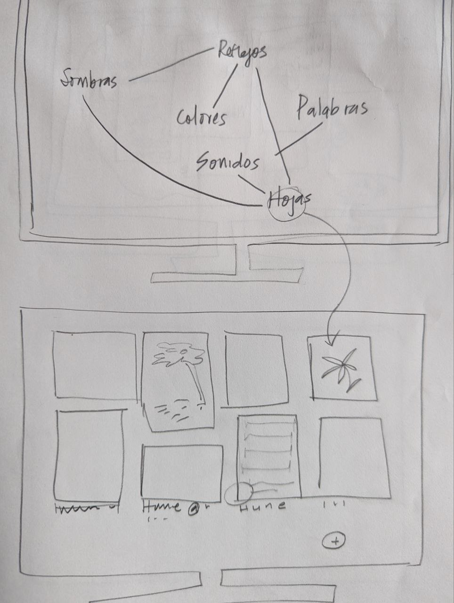
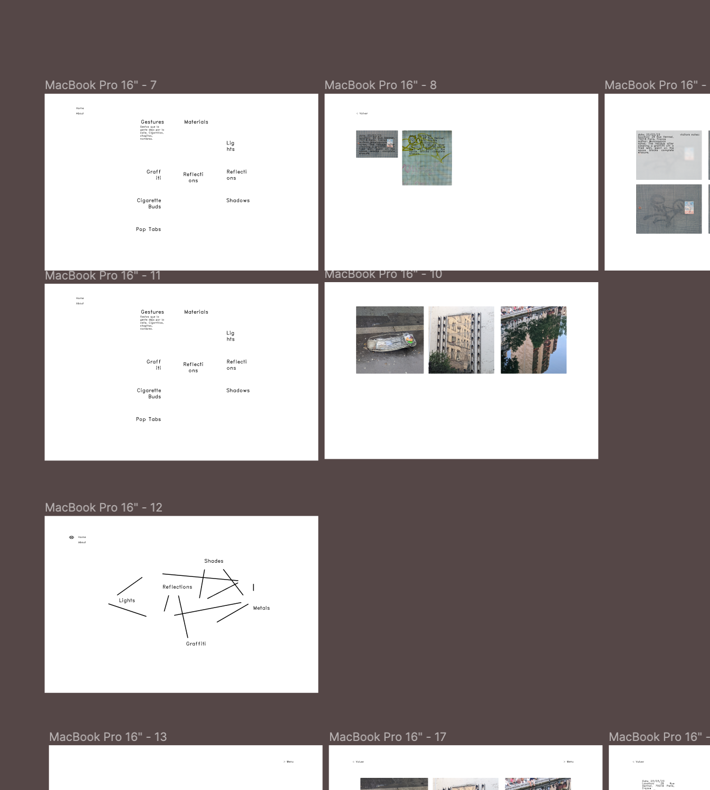

Subjects I See 
(A gallery of visual patterns)

by 
MONCOPONCO
(Magdalena Fraga Lauhirat)

About the Project

This is a collection of images that invite us to search for patterns in our every day life.

Add the URL Link to your <a href="https://moncoponco.github.io/">live project site</a> for easy access right from the code files and ReadMe.

About the project development:

I began the project with the goal to put together my extensive collection of images collected in the last year. These images are of patterns of lights and shades that I find appealing. 

I knew going in that I would want words to take the visitor to a gallery, but I was unsure how the gallery and the word list would be organized. 

I did a few low-fidelity sketches and then moved to figma to play around with style and layout. See images below! 

In terms of UI styling, I was interested in brutalist websites. I chose this aesthetic because it fit well with the subject of the images, and because I personally find it beautiful! 

Overall, I am very satisfied with the results. 

Sources:

The greater percentage of the pictures were taken by me, a small portion were sent to me by friends. 

References / external acknowledgements:

Font from <a href="http://hershey-noailles.luuse.io/www/#Hershey-Noailles-Futura-Duplex-Regular"> Hershey Noailles </a>